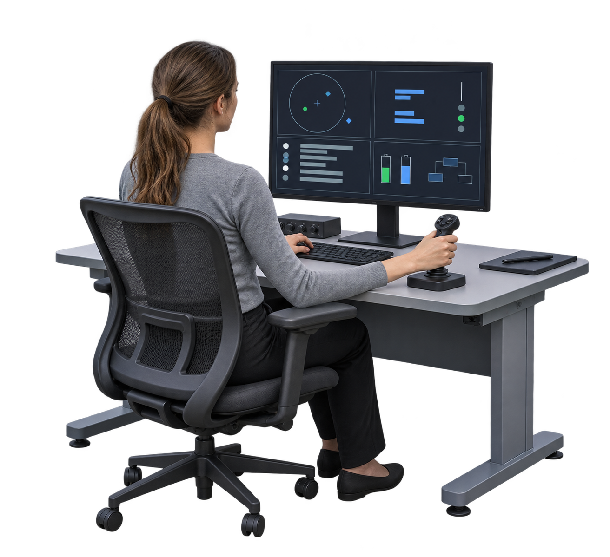
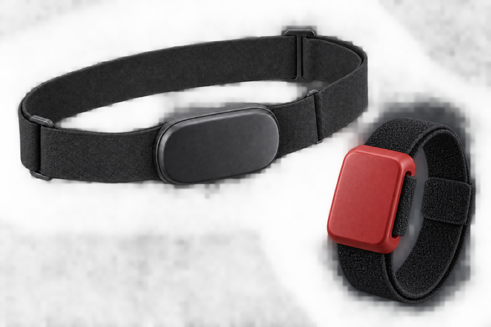
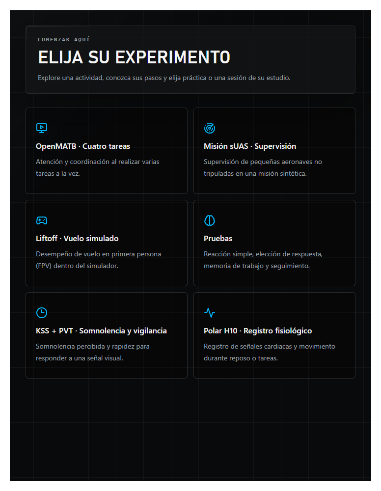
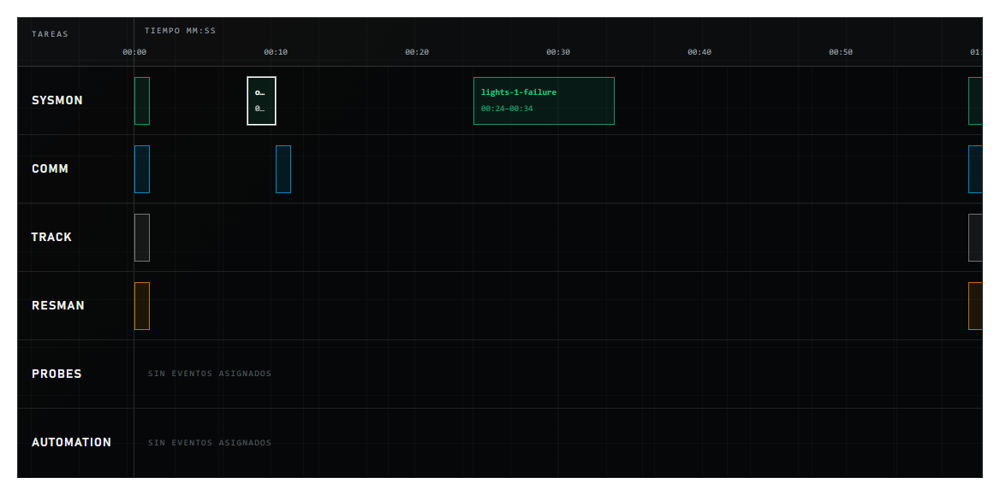
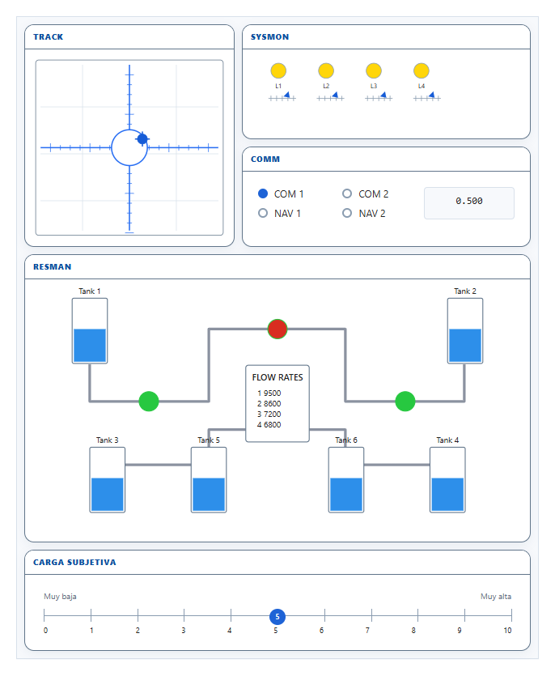
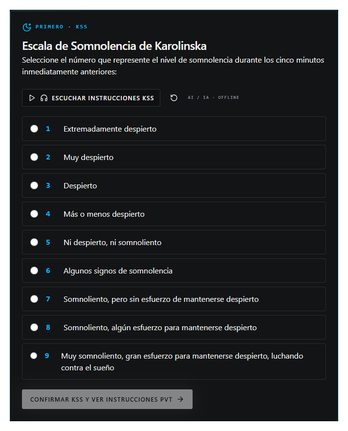
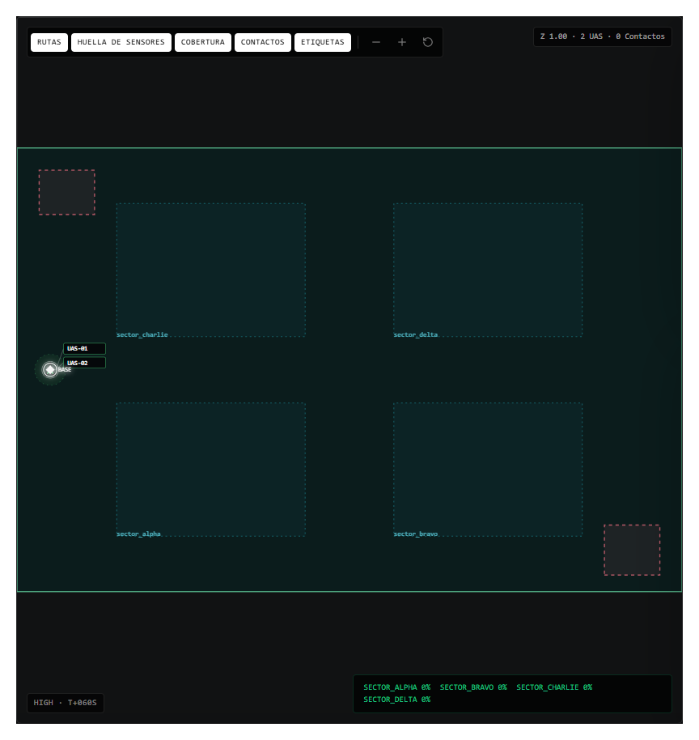
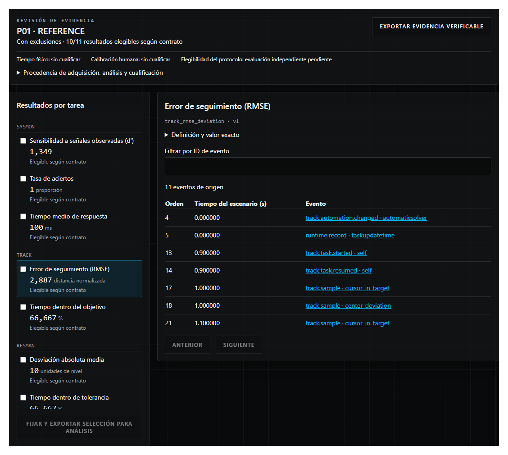
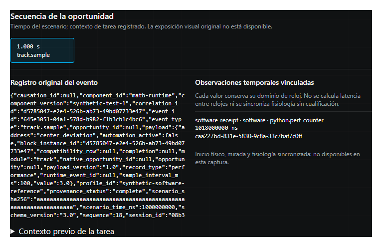

# Contenido de la presentación EMAVI

Pública clasificada. Texto condensado para los cuadros de la plantilla FAC. Los detalles y las referencias completas se conservan en las notas y en Referencias_APA.md. Exportación pendiente de aprobación gráfica.

## 5. Pregunta y diseño

Demanda programada; desempeño y carga percibida por separado.

Seguimiento de cada persona entre visitas.

Ilustración conceptual generada con IA; sin datos ni captura de MATB.

## 6. Fundamento y reproducibilidad

- OpenMATB: personalización y replicabilidad [1].
- USAARL: transiciones y automatización [5].
- 7/19 estudios describieron su configuración con detalle suficiente [2].

## 7. ASTRA: seguimiento longitudinal

- 2 misiones; hasta 6 participantes por misión.
- 8 visitas: basal, 6 intramisión y posegreso.
- 3 condiciones × 900 s de escenario.
- Orden contrabalanceado; reserva de 90 min.

## 8. Qué se mide en cada bloque

- SYSMON: detecciones, omisiones y latencias.
- TRACK: desviación respecto al objetivo.
- COMM y RESMAN: respuestas y regulación.
- KSS antes; ISA durante; NASA-TLX después.

## 9. Adquisición fisiológica

Polar H10: intervalos R–R, si la ruta se verifica.

ActiGraph: movimiento. HRV: descriptor derivado.

Sin señales humanas adquiridas en la demostración.

Ilustración conceptual generada con IA; equipos no conectados.

## 10. Demostración

## 11. Elegir una actividad

El catálogo presenta las tareas y sus requisitos.

La selección distingue práctica y participación en un estudio.

Captura local de demostración.

## 12. Diseñar el escenario

La línea temporal organiza tareas y eventos.

Duración y semilla definen una configuración reproducible.

La compilación materializa su procedencia.

## 13. Preparar OpenMATB

La consola configura el entorno de cuatro tareas.

La vista previa permite revisar la presentación antes de ejecutar.

El entorno de tareas se ejecuta en OpenMATB.

## 14. Somnolencia y vigilancia

KSS precede a las instrucciones del PVT.

La secuencia enlaza preparación, actividad y cierre.

Participante de demostración; sin datos humanos.

## 15. Supervisar una misión

El módulo sUAS integra mapa, flota, alertas y controles.

La captura procede de una prueba técnica sintética.

El registro conserva eventos para revisión posterior.

## 16. Revisar la evidencia

La carga pareada reúne manifiestos, eventos y observaciones temporales.

La consola enlaza cada métrica con su evidencia.

Ejemplo sintético de referencia.

## 17. Del evento al resultado

La revisión conserva el evento y su base temporal.

Los motivos de elegibilidad permanecen visibles.

La evidencia puede exportarse para recomputación.

## 18. Del registro al análisis longitudinal

- Escenario → eventos → métricas versionadas.
- Persona → visita → bloque → condición.
- RTLX: media de 6 respuestas (0–10) × 10.
- Revisar calidad antes de comparar trayectorias.

## 19. Estado de la evidencia y siguiente etapa

- CEINNA: verificaciones con datos sintéticos.
- EMAVI: recorrido de interfaces reales.
- Calificar tiempo físico y respuesta humana.
- Siguiente etapa: ejecutar y analizar visitas.

## 20. Conclusiones

- Documentar la demanda experimental.
- Vincular configuración, evento y métrica.
- Revisar calidad y procedencia del registro.
- Seguir la trayectoria de cada persona.

## 21. Referencias I

- [1] Cegarra et al. (2020). OpenMATB.
- [2] Pontiggia, Gomez-Mérino et al. (2024). MATB y niveles de carga mental.
- [3] Pontiggia, Fabries et al. (2024). Hipoxia, restricción de sueño y carga.

## 22. Referencias II

- [4] Tortello et al. (2020). Estimación temporal en la Antártida.
- [5] Vogl et al. (2024). USAARL MATB.
- [6] Laverde-López et al. (2022). Validación colombiana de KSS.
