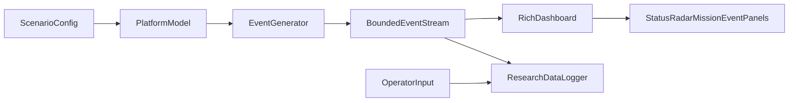

# 🛩️ UAV & Fighter Aircraft Monitoring System

A real-time, visually stunning terminal-based monitoring system for UAV (Unmanned Aerial Vehicle) and Fighter Aircraft operations with realistic mission challenges.

## ✨ Features

- **Rich Terminal UI**: Beautiful, modern terminal interface with live updates
- **UAV Monitoring**: Track drone operations including surveillance, reconnaissance, and delivery missions
- **Fighter Aircraft Ops**: Monitor combat aircraft with radar, weapons systems, and tactical operations
- **Real-time Events**: Dynamic event sequences with realistic challenges
- **Mission Objectives**: Track mission progress with visual indicators
- **Threat Detection**: Simulated radar and threat warning systems
- **System Health**: Monitor fuel, battery, weapons, and system status

## 🚀 Quick Start

```bash
# Install dependencies
pip install -r requirements.txt

# Run the monitoring system
python -m aircraft_monitor

# Or run specific modules
python -m aircraft_monitor.demo_uav      # UAV operations demo
python -m aircraft_monitor.demo_fighter  # Fighter aircraft demo
python -m aircraft_monitor.demo_combined # Combined operations

# Optional runtime flags
python -m aircraft_monitor fighter --event-delay 0.35
python -m aircraft_monitor combined --headless

# Run a MATB-inspired research protocol
python -m aircraft_monitor experiment --headless --research-modality uas --seed 42
```

## 🧪 Non-interactive / CI usage

When stdout/stderr are not attached to a TTY (for example, in CI logs), the app:

- Runs in **headless mode** (prints a readable event stream instead of a full-screen UI)
- Avoids blocking on interactive prompts (defaults to `combined` mode when no mode is provided)
- Supports explicit override via environment variable:
  - `AIRCRAFT_MONITOR_HEADLESS=true` forces headless mode
  - `AIRCRAFT_MONITOR_HEADLESS=false` forces full-screen mode

### CLI Options

- `mode` (optional positional): `uav`, `fighter`, `combined`, or `experiment`
- `--event-delay <seconds>`: set frame/event pacing (`0.05` to `5.0`)
- `--headless`: force non-interactive stream output
- `--participant-id <id>`: participant identifier for `experiment` mode
- `--session-id <id>`: session identifier for `experiment` mode
- `--seed <integer>`: deterministic event seed for `experiment` mode
- `--research-modality <uas|fighter|combined>`: research scenario family
- `--research-output-dir <path>`: output directory for JSONL events and summary files

## 🧠 MATB-Inspired Research Mode

`experiment` mode implements the easiest publishable features from the AF-MATB and USAARL MATB lineage:

- **Seeded repeatability**: every protocol run stores the base seed and block metadata.
- **Demand transitions**: low, medium, and high workload blocks progressively increase event density.
- **Instantaneous workload probes**: ISA-style 1-10 workload prompt events are injected during each block.
- **Automation markers**: manual, advisory, and forced-handoff blocks capture automation mode and reliability.
- **Structured data export**: every emitted event is written to `events.jsonl`, with a compact `summary.json`.

By default, generated research files go to `/root/.openclaw/workspace/exports` unless `AIRCRAFT_MONITOR_OUTPUT_DIR` or `--research-output-dir` overrides the location.

## 📦 Project Structure

```
aircraft_monitor/
├── __init__.py           # Package initialization
├── __main__.py           # Entry point
├── models/               # Data models
│   ├── __init__.py
│   ├── uav.py           # UAV model
│   └── fighter.py       # Fighter aircraft model
├── events/               # Event system
│   ├── __init__.py
│   ├── base.py          # Base event classes
│   ├── uav_events.py    # UAV-specific events
│   └── fighter_events.py # Fighter-specific events
├── visualization/        # Rich UI components
│   ├── __init__.py
│   ├── dashboard.py     # Main dashboard
│   ├── panels.py        # UI panels
│   └── themes.py        # Color themes
├── simulation/           # Simulation engine
│   ├── __init__.py
│   └── engine.py        # Event simulation
├── research/             # Human-factors protocol and logging
│   ├── __init__.py
│   ├── logger.py        # JSONL event and summary logger
│   ├── protocol.py      # Demand blocks and protocol definitions
│   └── runner.py        # Research experiment execution
├── demo_uav.py          # UAV demo
├── demo_fighter.py      # Fighter demo
└── demo_combined.py     # Combined demo
```

## 🎮 Controls

During simulation:
- Press `Ctrl+C` to gracefully exit
- Events auto-progress with realistic timing

## 📊 Visualization Components

- **Status Panels**: Real-time aircraft status with gauges
- **Event Timeline**: Scrolling event log with severity colors
- **Radar Display**: ASCII radar with threat indicators
- **Mission Progress**: Visual progress bars for objectives
- **System Health**: Fuel, weapons, and sensor status

## 🔧 Configuration

Customize simulation parameters in the demo files or create your own scenarios.

## 🗺️ Roadmap

The current platform is a Python/Rich terminal dashboard. It can be expanded into a human-factors research platform without replacing the UI by treating each aircraft or mission family as a bounded scenario model that emits timestamped events into reusable panels. A browser/TSX interface can be added later, but the lowest-risk path is to preserve the existing Rich UI as the operator station and add research instrumentation around the current model -> event -> dashboard flow.

### Research Architecture



Recommended implementation layers:

| Layer | Existing location | Research extension |
|---|---|---|
| Scenario entrypoint | `aircraft_monitor/__main__.py` | Add modes such as `uas`, `swarm`, `fighter`, `military`, and `experiment` while keeping `uav`, `fighter`, and `combined` compatible. |
| Scenario orchestration | `aircraft_monitor/simulation/engine.py` | Add scenario factories for UAS, swarm s-UAS, fighter combat, transport, tanker, ISR, and joint operations. |
| Platform state | `aircraft_monitor/models/uav.py`, `aircraft_monitor/models/fighter.py` | Add typed models for `Swarm`, `MilitaryAircraft`, crew state, automation state, datalink state, task demand, and operator workload probes. |
| Event generation | `aircraft_monitor/events/base.py`, `aircraft_monitor/events/*_events.py` | Keep all scenario changes as immutable `Event` records with severity, category, source, timestamp, and structured data. |
| Operator display | `aircraft_monitor/visualization/dashboard.py`, `aircraft_monitor/visualization/panels.py` | Add modality-specific status panels while reusing `EventLogPanel`, `RadarPanel`, and `MissionPanel`. |
| Research logging | `aircraft_monitor/research/logger.py` | Record event timestamps, response latency anchors, workload prompts, scenario seeds, automation settings, and summary counts. |

The research design should follow the MATB tradition: use configurable event rates, concurrent tasks, response windows, and task overlap to produce low, medium, and high workload blocks. MATB research commonly manipulates number of subtasks, event rate, event overlap, and response time; recent reviews report median MATB test duration around 20 min and stimulus rates of roughly 3 events/min for low workload and 23.5 events/min for high workload, with substantial variability across studies [Pontiggia et al., 2024]. The USAARL MATB also supports real-time workload probes every 30 s or 1 min using an instantaneous 1-10 rating rather than pausing the experiment for a full NASA-TLX [Vogl et al., 2024].

### Common Human-Factors Core

These parameters should be implemented across all modalities so studies are comparable:

| Construct | Best parameterization | Primary measures |
|---|---|---|
| Mental workload | Event rate, number of concurrent panels, alert frequency, response window, automation support level, mission phase complexity | NASA-TLX post-block, instantaneous workload 1-10, response latency, missed events, dual-task decrement, optional HR/HRV/EEG/eye tracking |
| Situation awareness | Query probes at freeze points, map/radar uncertainty, hidden system failures, stale datalink data, conflict prediction | SAGAT-style perception/comprehension/projection probes, contact recall, threat prioritization accuracy, route prediction accuracy |
| Trust in automation | Automation reliability, false-alarm rate, missed-detection rate, confidence display, explanation availability, handoff transparency | Automation use, manual override rate, agreement with recommendations, trust questionnaire, recovery after automation failure |
| Attention management | Visual salience, alert modality, panel density, competing auditory messages, task-switch frequency | Time to first response, event detection rate, communication errors, dwell time if eye tracking is available |
| Decision quality | Ambiguous threats, rules of engagement, fuel/range tradeoffs, lost-link procedures, re-tasking pressure | Correct action rate, time to decision, unsafe action count, mission score, after-action explanation quality |
| Fatigue and sustained operations | Trial duration, vigilance periods, monotonous monitoring, circadian or sleep-loss protocols | Performance slope over time, lapses, delayed responses, subjective sleepiness, physiological workload trends |

Situation awareness should be treated as a three-level construct: perception of relevant cues, comprehension of what they mean, and projection of future state. Endsley's dynamic-systems model remains the main reference for SA measurement and explains why workload, stress, automation, and system complexity can degrade operator SA [Endsley, 1995a; Endsley, 1995b]. Wickens emphasizes that aviation SA includes spatial awareness, system awareness, and task awareness, and that workload rises when competing tasks exceed limited attentional resources [Wickens, 2002].

### Modality 1: UAS / Remotely Piloted Aircraft

The current `UAV` model is the natural base for UAS research. Expand it from one vehicle demo telemetry into an operator-in-the-loop ground-control-station scenario.

| Area | Best parameters |
|---|---|
| Aircraft state | Altitude, airspeed, heading, fuel, battery, GPS satellites, waypoint index, mission progress, autopilot state, payload status |
| Control and datalink | Uplink/downlink quality, latency, packet loss, lost-link state, command acknowledgment time, stale telemetry age, fallback route |
| Payload | EO/IR/SAR/SIGINT/LIDAR state, target-detection confidence, image queue length, sensor slew time, classification uncertainty |
| Airspace and hazards | Traffic contacts, geofence conformance, terrain/obstacle proximity, weather, restricted areas, lost-link squawk/procedure state |
| Operator tasks | Monitor telemetry, classify sensor detections, respond to communication requests, accept/reject automation, re-plan waypoints |

Suggested workload ladder:

| Level | Scenario manipulation | Expected endpoint |
|---|---|---|
| Low | One UAS, stable datalink, sparse sensor events, generous response windows | Baseline response latency and detection accuracy |
| Medium | One UAS with intermittent link degradation, more target images, occasional route changes | Increased task switching and moderate workload |
| High | BVLOS-like degraded link, simultaneous sensor classification, emergency re-route, lost-link procedure, traffic conflict | Higher missed-event risk and SA probe failures |

UAS safety work should explicitly model the system as aircraft, control station, data links, payload, crew, procedures, and support equipment rather than just the air vehicle. Human-factors mishap analyses emphasize workload, fatigue, crew coordination, training, and ground-control-station design [Waraich et al., 2013]. FAA lost-link guidance defines lost link as loss of the command and control link, distinguishes uplink from downlink, and treats preprogrammed lost-link procedures as safety mitigations; the simulator should therefore include link-loss detection, operator awareness of the programmed contingency, and whether the aircraft follows or deviates from that contingency.

### Modality 2: Swarm s-UAS / Human-Swarm Interaction

Swarm s-UAS should not be implemented as many independent copies of the current UAV panel. Human-swarm interaction research shows that direct control of individual agents increases workload and does not scale well, whereas indirect control lets the operator treat the swarm as a coherent entity but may reduce fine control [Bjurling, 2025]. The UI should therefore expose both aggregate swarm state and limited drill-down.

| Area | Best parameters |
|---|---|
| Swarm state | Number of agents, active/inactive count, centroid, dispersion, formation, coverage percent, cluster count, agent health distribution |
| Autonomy and control | Direct control, waypoint groups, virtual beacons, behavior modes, rules of engagement, operator influence level |
| Communication | Mesh health, command propagation delay, percent agents receiving command, degraded nodes, relay loss |
| Mission | Search area, coverage rate, target probability map, no-fly zones, dynamic obstacles, re-tasking events |
| UI abstraction | Individual icons for small swarms, aggregate blobs/heatmaps for larger swarms, predictive future-state overlays |

Suggested workload ladder:

| Level | Scenario manipulation | Expected endpoint |
|---|---|---|
| Low | 3-5 s-UAS, group waypoint control, simple coverage task, no adversarial interference | Baseline swarm comprehension and command latency |
| Medium | 8-15 s-UAS, partial comms loss, dynamic no-fly zone, target-priority changes | Higher re-planning demand and moderate trust calibration |
| High | 20+ s-UAS, jamming, agent attrition, multiple simultaneous targets, ambiguous autonomy recommendation | Increased overload risk, over-control, and degraded projection SA |

Human-swarm literature supports adding predictive information: forecasts of future swarm states can improve accuracy, reduce input frequency, and reduce overcorrection [Bjurling, 2025]. Prior work also suggests the ideal level of human influence depends on environmental complexity; in obstacle-rich environments, some human intervention improves performance, but too much intervention can degrade swarm performance [Walker et al., 2013]. The roadmap should therefore implement human influence level as an experimental variable, not as a fixed UI setting.

### Modality 3: Fighter Aircraft

The existing `FighterAircraft` model already supports tactical aircraft research: speed, Mach, G, fuel, oxygen, weapons, radar contacts, missile warnings, defensive systems, avionics, and mission objectives. The research roadmap should add richer cockpit workload, tactical decision, and automation constructs rather than only more aircraft telemetry.

| Area | Best parameters |
|---|---|
| Flight state | Altitude, Mach, true airspeed, heading, G load, fuel/bingo state, oxygen, engine state, landing gear, canopy |
| Tactical state | Radar mode, contact count, hostile/unknown/friendly classification, lock state, missile warning time-to-impact, countermeasures |
| Mission state | CAP, intercept, strike, SEAD, escort, RTB, aerial refueling, divert, rules of engagement |
| Pilot tasks | Threat prioritization, weapons selection, countermeasure timing, fuel/mission tradeoff, communication response, target classification |
| Automation | Radar assistance, threat ranking, route recommendation, checklist automation, voice/touch/multimodal control, transparency of automation actions |

Suggested workload ladder:

| Level | Scenario manipulation | Expected endpoint |
|---|---|---|
| Low | Stable CAP, low contact density, no weapons release, nominal systems | Baseline scan and communication response |
| Medium | Unknown contacts, fuel planning, intermittent radar clutter, one tactical decision | Increased decision latency and moderate SA demand |
| High | Missile warning, high-G maneuver, multiple contacts, jamming, ROE ambiguity, simultaneous comms | Workload saturation, threat-prioritization errors, missed communication |

Fighter and military cockpit research should avoid assuming that more automation is always better. Meta-analytic work on automation shows performance benefits can come with costs when automation fails or when operators lose awareness [Onnasch et al., 2013]. In multiple-UAV and aviation studies, operators often prefer intermediate automation because it improves support while preserving insight and trust [Prinet et al., 2012]. A fighter roadmap should therefore include transparency, handoff quality, and manual recovery after automation failure as first-class parameters.

### Modality 4: Broader Military Aircraft / Joint Operations

Military aircraft beyond fighters should be treated as crewed mission systems: transport, tanker, ISR, helicopter, bomber, AWACS, and joint command-and-control platforms. These scenarios can reuse the dashboard but should shift emphasis from weapon state to crew coordination, communication load, mission system management, and shared SA.

| Aircraft family | Best parameters |
|---|---|
| Transport / airlift | Cargo status, route constraints, terrain/weather, fuel, engine health, checklist events, landing-zone threat level |
| Tanker | Receiver queue, fuel offload rate, rendezvous timing, airspace deconfliction, weather, boom/drogue state |
| ISR / patrol | Sensor queue, track custody, target confidence, data-link load, analyst/operator handoffs |
| Helicopter / MUM-T | Route hazard detection, landing-zone classification, multiple-UAV monitoring, voice/touch input, crew communication load |
| Bomber / strike package | Mission timeline, target list, threat rings, electronic warfare, weapons inventory, abort/divert criteria |

Suggested workload ladder:

| Level | Scenario manipulation | Expected endpoint |
|---|---|---|
| Low | Single mission objective, stable comms, low crew coordination demand | Baseline mission monitoring and checklist compliance |
| Medium | Multiple mission objectives, changing weather/threats, handoff to another platform | Shared-SA and communication workload effects |
| High | Joint operation with UAS, fighter escort, datalink degradation, conflicting priorities, time-critical re-plan | Team SA, prioritization, and coordination breakdown risk |

Manned-unmanned teaming evidence is directly relevant. In a simulated military helicopter supervising multiple UAVs, touch and multimodal inputs outperformed voice-only control on photo classification time, percentage classified, instrument warning response time, communication accuracy, workload, SA, and usability [Levulis et al., 2018]. This supports a roadmap where voice commands are optional research variables rather than the default primary input.

### Research Data Model

Every scenario should emit a trial-level and event-level dataset.

| Dataset | Fields |
|---|---|
| Trial metadata | Participant ID, session ID, scenario ID, modality, seed, workload level, automation level, display configuration |
| Event log | Monotonic timestamp, wall-clock timestamp, source, severity, category, title, structured event data |
| Operator actions | Input timestamp, action type, target object, correctness, latency from cue, manual/automated origin |
| Performance | Detection rate, false alarm rate, missed events, route deviation, target classification accuracy, mission score |
| Workload and SA | Instantaneous workload rating, NASA-TLX after block, SAGAT/SA query accuracy, trust ratings |
| Optional physiology | HR, HRV, respiration, EEG markers, eye tracking, synchronization pulses |

Use monotonic timing for response latency and wall-clock timing for audit logs. Keep all loops bounded, use fixed scenario durations or fixed event counts, and record the scenario seed for reproducibility.

### Phased Implementation

| Phase | Goal | Deliverable |
|---|---|---|
| 1 | Research instrumentation | Done: JSONL logger, scenario seed, trial metadata, workload prompt events, automation markers, and summary JSON. |
| 2 | UAS research mode | Extend the existing `UAV` scenario with datalink degradation, lost-link procedures, sensor classification, and BVLOS-like conflicts. |
| 3 | Fighter research mode | Add tactical workload blocks, ROE ambiguity, radar clutter, automation support levels, and post-block NASA-TLX. |
| 4 | Swarm s-UAS mode | Add aggregate swarm model, swarm panel, group commands, comms degradation, predictive overlays, and influence-level manipulation. |
| 5 | Military/joint operations mode | Add transport/tanker/ISR/helicopter mission families and multi-platform shared-SA scenarios. |
| 6 | Experimental protocol runner | Add scripted blocks, counterbalancing, training trials, practice criteria, CSV/JSONL export, and optional physiological synchronization. |
| 7 | Optional web UI | Add a TSX/JS front end only after the Python research core is stable; connect through HTTP/WebSocket event streams. |

### Parameter Matrix by Modality

| Modality | Highest-value operational parameters | Highest-value human-factors parameters |
|---|---|---|
| UAS | Datalink quality, stale telemetry age, waypoint deviation, sensor queue, lost-link profile, detect-and-avoid conflicts | SA, attention allocation, workload, target classification latency, trust in automation, emergency procedure compliance |
| Swarm s-UAS | Agent count, coverage, dispersion, mesh health, group behavior, attrition, command propagation delay | Human influence level, over-control, aggregate-state comprehension, trust calibration, command latency, projection SA |
| Fighter | G load, fuel/bingo, radar contacts, missile TTI, jamming, weapon state, oxygen, mission phase | Threat prioritization, tactical decision latency, workload saturation, automation transparency, ROE interpretation, communication accuracy |
| Military aircraft | Mission timeline, crew roles, comms load, airspace constraints, cargo/fuel/sensor tasks, joint platform interactions | Team SA, crew coordination, shared workload, handoff quality, checklist discipline, fatigue and vigilance |

### References

- Aweiss, A., Owens, B. D., & Rios, J. (2018). Unmanned Aircraft Systems (UAS) Traffic Management (UTM) National Campaign II. American Institute of Aeronautics and Astronautics. https://doi.org/10.2514/6.2018-1727
- Bjurling, O. (2025). Designing Human-Swarm Interaction Systems. Linkoping University Electronic Press. https://doi.org/10.3384/9789180759595
- Cahill, J., Callari, T. C., & Fortmann, F. (2018). Adaptive Automation and the Third Pilot. InTech. https://doi.org/10.5772/intechopen.73689
- Cummings, M. L., & Mitchell, P. (2007). Operator scheduling strategies in supervisory control of multiple UAVs. Aerospace Science and Technology, 11(4), 339-348. https://doi.org/10.1016/j.ast.2006.10.007
- Endsley, M. R. (1995a). Measurement of situation awareness in dynamic systems. Human Factors, 37(1), 65-84. https://doi.org/10.1518/001872095779049499
- Endsley, M. R. (1995b). Toward a theory of situation awareness in dynamic systems. Human Factors, 37(1), 32-64. https://doi.org/10.1518/001872095779049543
- Federal Aviation Administration. (2016). Unmanned Aircraft Systems (UAS) Lost Link, Notice N JO 7110.724. https://www.faa.gov/documentLibrary/media/Notice/N_JO_7110.724_5-2-9_UAS_Lost_Link_2.pdf
- Hoff, K. A., & Bashir, M. (2015). Trust in automation. Human Factors, 57(3), 407-434. https://doi.org/10.1177/0018720814547570
- Levulis, S. J., DeLucia, P. R., & Kim, S. Y. (2018). Effects of touch, voice, and multimodal input, and task load on multiple-UAV monitoring performance during simulated manned-unmanned teaming in a military helicopter. Human Factors, 60(8), 1117-1129. https://doi.org/10.1177/0018720818788995
- NASA. (2011). The Multi-Attribute Task Battery II (MATB-II) Software for Human Performance and Workload Research. https://ntrs.nasa.gov/api/citations/20110014456/downloads/20110014456.pdf
- Onnasch, L., Wickens, C. D., Li, H., & Manzey, D. (2014). Human performance consequences of stages and levels of automation. Human Factors, 56(3), 476-488. https://doi.org/10.1177/0018720813501549
- Pontiggia, A., Gomez-Merino, D., & Quiquempoix, M. (2024). MATB for assessing different mental workload levels. Frontiers in Physiology, 15, 1408242. https://doi.org/10.3389/fphys.2024.1408242
- Prinet, J. C., Terhune, A., & Sarter, N. (2012). Supporting dynamic re-planning in multiple UAV control: A comparison of 3 levels of automation. Proceedings of the Human Factors and Ergonomics Society Annual Meeting, 56(1), 423-427. https://doi.org/10.1177/1071181312561095
- Vogl, J., McCurry, C. D., Bommer, S., & Atchley, J. A. (2024). The United States Army Aeromedical Research Laboratory Multi-Attribute Task Battery. Frontiers in Neuroergonomics, 5, 1435588. https://doi.org/10.3389/fnrgo.2024.1435588
- Walker, P., Nunnally, S., & Lewis, M. (2013). Levels of automation for human influence of robot swarms. Proceedings of the Human Factors and Ergonomics Society Annual Meeting, 57(1), 429-433. https://doi.org/10.1177/1541931213571093
- Waraich, Q. R., Mazzuchi, T. A., & Sarkani, S. (2013). Minimizing human factors mishaps in unmanned aircraft systems. Ergonomics in Design, 21(1), 25-32. https://doi.org/10.1177/1064804612463215
- Wickens, C. D. (2002). Situation awareness and workload in aviation. Current Directions in Psychological Science, 11(4), 128-133. https://doi.org/10.1111/1467-8721.00184

## 📄 License

MIT License - See LICENSE file for details.
