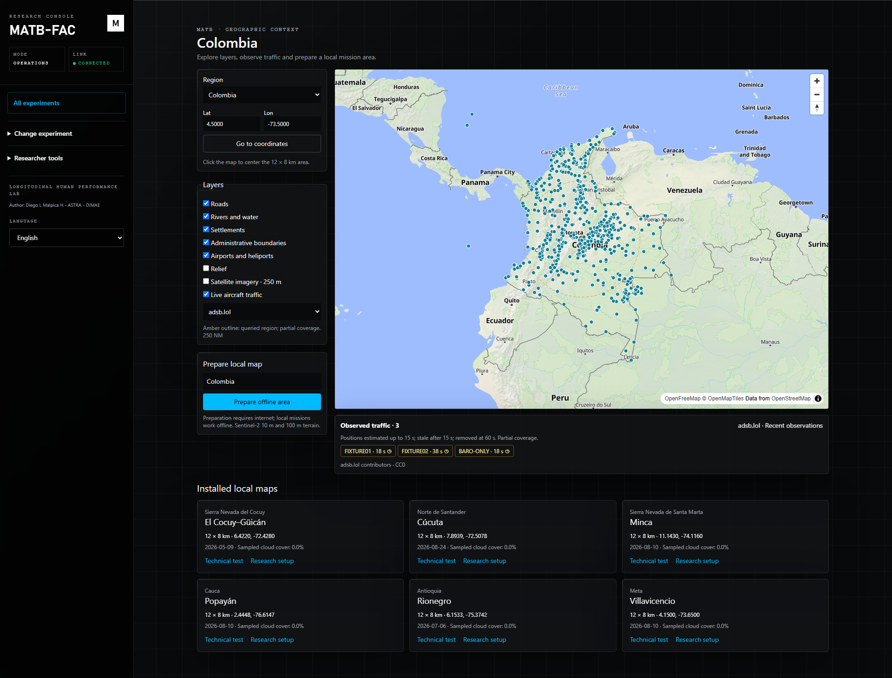
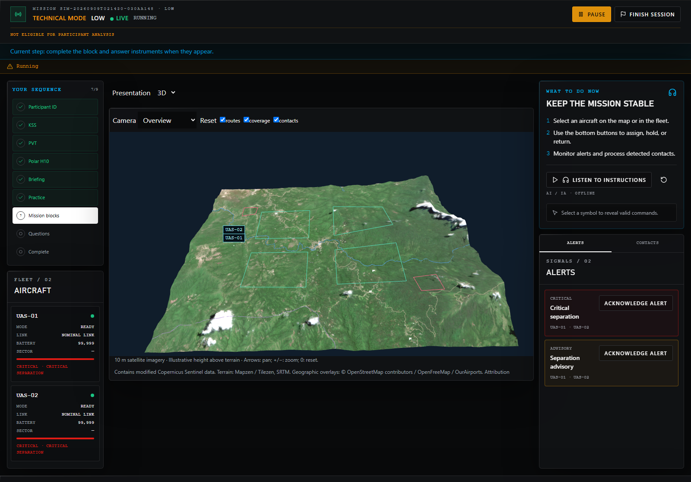

# Colombia geography and traffic verification

Verified locally on 2026-09-08 and 2026-09-09, America/Bogota. See the [usage and implementation guide](colombia-geography-traffic.md)
for startup, scene preparation, provider configuration and capture reuse.

## Scope and environment

The national explorer uses MapLibre GL JS 6.8.0. Local mission rendering uses
Three.js 0.186.0 and TypeScript. Verification used Windows, Python 3.12.13,
Next.js 16.3.3, and Chromium 151.0.7922.34. The optional raster preparation
environment is isolated from MATB's experiment environment.

The browser renderer reported ANGLE / Vulkan / SwiftShader, DPR 1. These are
software-renderer checks; target workstation GPU performance, physical timing
accuracy, and human workload calibration have not been established.

## Automated checks

| Check | Result |
| --- | --- |
| Full repository Python suite, including sUAS and Liftoff (documentation tested separately) | 786 passed, 10 skipped |
| OpenMATB runtime suite | 846 passed |
| Full backend component suite | 267 passed, 1 skipped |
| Final backend core-only suite | 187 passed, 1 skipped |
| Final component lifecycle, geography and journey regression | 16 passed |
| Documentation, public-core export and component licensing tests | 53 passed, 5 skipped |
| Optional scene packager: sparse-data masking, failed preparation cleanup and immutable publication | 3 passed |
| Final frontend suite after dependency updates | 135 passed in 40 files |
| Production build, TypeScript compilation and ESLint | Passed |
| Dependency audit after compatible transitive updates | 0 reported vulnerabilities |
| Windows launcher portability and relocation smoke | Passed |
| Browser coverage across full and focused runs | All 36 distinct cases passed |
| Core-only browser workflow | 2 passed |

The browser result combines the full-suite runs with focused verification of
the four-block mission, observer reconnection, responsive layouts and technical
launcher after the test corrections. It is not a claim that all 36 ran in one
uninterrupted final invocation. Core browser checks verify a separate component
configuration. Overlapping backend runs are separate configurations, not
additional unique test counts. Skips cover unavailable optional dependencies and checks assigned to
other platforms. Existing Python dependency warnings remain visible in the test
output. The public-core dry run passes its selection checks; its independent
scientific and release-governance blockers remain unchanged.

All 12 geography and presentation browser scenarios passed together in the full
browser run: online layers, five regional scenes (Cocuy is covered by the three
fleet profiles), Colombia controls/handoff/outage, corrupt-asset rejection and
SAGAT/capture/replay. This includes the stronger checks for rendered traffic and
the bounded query outline.

The earlier optional online recheck encountered a DNS failure. The 2026-09-09
release recheck resolved the service and passed actual vector, imagery and relief
tile requests. The national screenshots were refreshed from that successful run.
See [successful network evidence](assets/colombia/online-release-network.json);
[earlier DNS evidence](assets/colombia/online-recheck-network.json) is retained
as historical context. Service availability and traffic coverage can vary later.

The checks cover normalization, incomplete and invalid provider observations,
cache coalescing, rate limits and outages, six geographic origins, geoid
conversion, capture checksums/provider/timeline validation, immutable scene
publication, research rejection of live traffic, and sealed public replay.
Traffic acquisition and rendering do not change deterministic engine hashes.
Git attributes preserve geographic asset bytes across operating systems; staged
assets were compared byte-for-byte with the verified working packages.

The delayed questionnaire regression recreates an ISA response arriving after
the next SAGAT question. The later question must remain visible and the mission
display must remain concealed. Browser acceptance also requires an accepted
SAGAT submission, preventing a timed-out question from satisfying this check.

## Installed scenes

Each scene has a 12 × 8 km mission footprint and a 2 km terrain/imagery margin.
All six manifests and their asset hashes were verified. The imagery selection
reported 0% sampled cloud cover in each mission footprint. This is a sampled
quality measure, not a guarantee that every pixel or the surrounding margin is
cloud free.

| Scene | Sentinel-2 acquisition | Manifest SHA-256 |
| --- | --- | --- |
| Villavicencio | 2026-08-10 | `d0c9b5fd91158456362aa05b77b32c829a10efe442d50ba7765b9a993d6567f3` |
| Popayán | 2026-08-10 | `991428a1f6ca82f4d6251abc155f9e2cd4766a2d60118f6fd5e38efca76187e7` |
| Cúcuta | 2026-08-24 | `58220eccc6a2138674cb7fa3fe02b8c98ce44c7cfc8180cafbf869b22078138a` |
| Rionegro | 2026-07-06 | `695fccf66960371b3b5c46372c8a5ff02422147a40ca2326fa8d54259b367bc2` |
| Minca | 2026-08-10 | `12dd3dd7a1d5456f21dcc7ab17da5fcbfbc7aaa78b4932e8bc3397bb1428d545` |
| El Cocuy–Güicán | 2026-05-09 | `11996fa6cf05770d6f1dbaa60bbe3d90c639a98e0ef041708ca35b6d967aa81d` |

Minca, Popayán and Rionegro respectively retain 99.999583%, 99.999688% and
99.999896% valid RGB pixels. The few missing pixels are transparent, without
imputation. The other packages predate the explicit valid-coverage field and
were prepared with strict complete-data checks. Scene manifests retain source
URLs, acquisition/radiometry details and per-asset hashes.

National geographic layers cover Colombia online, including an archipelago
selector. The installed offline scenes cover local areas within the requested
regions, not entire departments. The national reference catalog contains 722
non-closed OurAirports entries. Reference and geoid files have checksums in
`webui/frontend/public/geography/catalog.json`.

## Real service verification

At **2026-09-09 01:52 UTC**, six 50 NM adsb.lol queries completed. Villavicencio
returned two aircraft observations and Rionegro returned four; Popayán, Cúcuta,
Minca and Cocuy returned no observations. The six received observations included
geometric altitude. These counts describe that sample, not sustained coverage
or all aircraft present. Empty areas are never filled with synthetic traffic.

The same check received HTTP 200 responses for OpenFreeMap style, NASA GIBS
imagery and Terrarium relief. Browser checks separately verify actual vector,
imagery and relief tile requests, not only a visible canvas. Aggregate evidence:
[source-check.json](assets/colombia/source-check.json).

OpenSky normalization has automated fixture coverage. The credentialed OAuth
flow was not exercised with a user account. adsb.lol is the verified default.
Its [published data license](https://www.adsb.lol/privacy-license/) identifies
contributor data as CC0; source attribution is retained in MATB traffic frames.

## Renderer observations

A bounded sample after initial shader warmup used the Cocuy scene, the three
synthetic acceptance traffic observations, and a 1920 × 1080 browser viewport.

| Profile | MATB aircraft | Draw calls | Triangles | Geometries | Textures | CPU render-call p95 |
| --- | ---: | ---: | ---: | ---: | ---: | ---: |
| LOW | 2 | 33 | 38,916 | 33 | 2 | 3.7 ms |
| MEDIUM | 4 | 51 | 39,420 | 51 | 2 | 4.2 ms |
| HIGH | 8 | 87 | 40,428 | 87 | 2 | 7.1 ms |

Raw samples: [LOW](assets/colombia/low-renderer-metrics.json),
[MEDIUM](assets/colombia/medium-renderer-metrics.json),
[HIGH](assets/colombia/high-renderer-metrics.json). These timings measure the
JavaScript render call and exclude GPU completion and display latency; they
must not be reported as frame-time or FPS guarantees. Browser tests also check
that returning from 2D to 3D does not accumulate geometries.

## Visual evidence

The national screenshots use real online basemap/imagery services. Regional
screenshots show pinned terrain/imagery while external browser requests are
blocked. Traffic acceptance screenshots use explicitly named synthetic fixtures;
they do not document real flight positions.





Additional views: [national imagery](assets/colombia/colombia-imagery.png),
[Antioquia](assets/colombia/antioquia-online.png),
[Popayán](assets/colombia/popayan-v1.png), [Cúcuta](assets/colombia/cucuta-v1.png),
[Rionegro](assets/colombia/rionegro-v1.png),
[Cocuy with eight MATB aircraft](assets/colombia/cocuy-high.png),
[replay](assets/colombia/traffic-replay.png),
[mobile controls](assets/colombia/mobile-controls.png).

## Reproduce focused checks

From the repository root, using the MATB Python environment:

```powershell
$env:PYTHONDONTWRITEBYTECODE='1'
$env:PYTEST_DISABLE_PLUGIN_AUTOLOAD='1'
python -B -m pytest webui/backend/tests/test_geography.py webui/backend/tests/test_simulation_runtime.py webui/backend/tests/test_simulation_websocket_unit.py -k 'geography or traffic or presentation or disconnect' -p anyio.pytest_plugin -p no:cacheprovider -q
.\.venv-geography\Scripts\python.exe -B tests/suas/test_scene_packager.py
cd webui/frontend
npm run test -- src/components/mission src/lib/simulation src/lib/geography
npm run lint
npm run build
$env:MATB_E2E_TRAFFIC_FIXTURE='1'
$env:MATB_E2E_ONLINE_CHECK='1'
$env:MATB_E2E_REGION_CHECK='1'
$env:PW_TEST_MATCH='**/{geography,geography-assets,presentation}.spec.ts'
npm run test:e2e
```

Set `MATB_PYTHON` if the MATB interpreter is not `python` on PATH. The managed
runner needs ports 8000 and 3100 free and uses isolated database/export/capture
directories. The traffic fixture requires test mode and is never imported by
the production application. Public-service checks require internet; ordinary
deterministic browser tests mock or block those requests.
