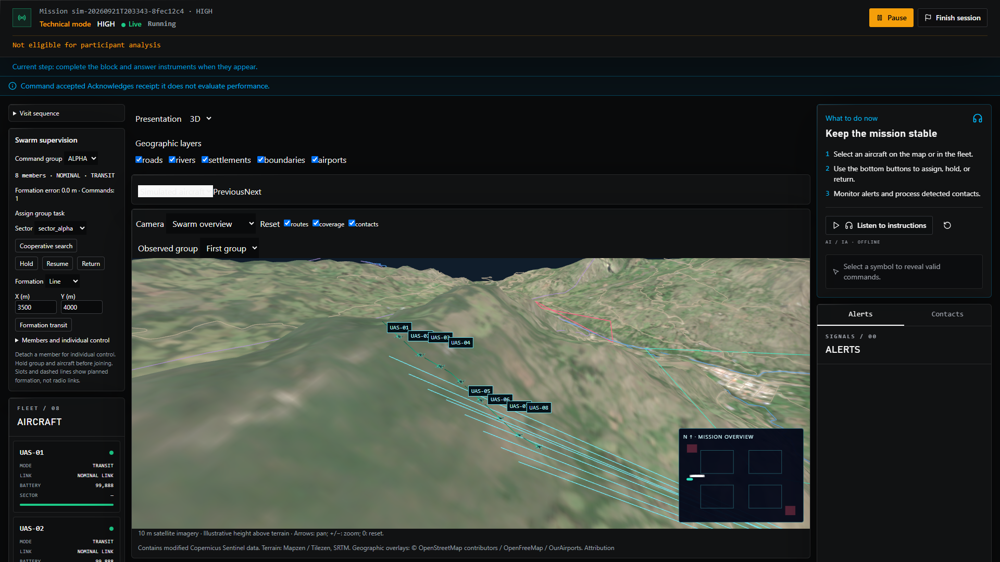
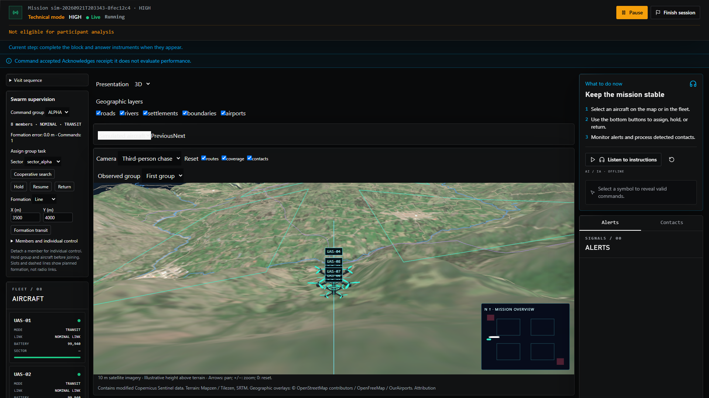

# Swarm supervision and procedural third-person presentation


This extension adds synthetic group tasking for up to eight aircraft. The scenario, coordination algorithm, console profile and presentation are versioned independently. Racing describes the quadcopter silhouette; the aircraft still use the deterministic planar MATB vehicle model with illustrative height above terrain.


## Start a session


1. Start the existing MATB backend and frontend with the repository launchers. Restart a running backend after updating this code and rebuild/restart its frontend.

2. For practice, open `/mission/test` and select **Swarm supervision** (`swarm_supervision`). Choose PRACTICE, LOW, MEDIUM or HIGH for 2, 4, 6 or 8 aircraft.

3. In presentation setup, select an installed offline scene, enable **Swarm view: racing quadcopters and chase**, and choose **3D** for the intended block. Camera transitions, contact navigation and adjustable layers remain explicit condition choices.

4. Prepare the session. Wait for the local scene and renderer qualification, then start the block.

5. In **Swarm supervision**, choose a command group. **Formation transit** assembles members and then moves the group to the entered X/Y waypoint in metres. **Cooperative search** divides the selected rectangular sector into contiguous strips. Hold, resume and return operate on the whole group.

6. Expand **Members and individual control** to detach a drone before giving individual commands from the fleet controls. To join a drone, hold it and the receiving group first, then explicitly issue a new group task.

7. Use **Swarm overview** to frame the group, **Third-person chase** to follow a selected drone, and **Free orbit** for manual inspection. The observed-group selector does not change the command group. In v3, selecting an aircraft in the scene changes visual focus; the fleet controls retain their own command selection.

8. Finish the session to seal the recording and open its debrief. Recorded replay restores presentation exposures and recorded trails; exploratory replay remains separate from command execution.


For research, configure and freeze the same scenario and a **presentation v3** condition in the existing study/assignment workflow. The backend rejects swarm research without an explicit v3 condition. Use existing study admission, preparation and workstation qualification steps. Software readiness is not physical display-timing or human-factors validation.


## Operator views

The screenshots show the local production build with synthetic aircraft. The
north-up inset stays visible while the operator switches between swarm framing
and individual chase. Terrain/imagery attribution remains in the app.





## Coordination and API


`schema_version: 2` adds `swarm: {algorithm: fixed-slot-v1, spacing_m: 60, groups: [...]}`. Groups partition the scenario aircraft; each block activates its own aircraft subset. The bundled scenario uses experimental 30 m advisory and 15 m critical separation, with distinct home positions. These are task parameters, not flight-separation recommendations.


The existing command endpoint accepts:


```json

{"kind":"SWARM_TASK","payload":{"group_id":"ALPHA","action":"SEARCH","target_id":"sector_alpha"}}

```


```json

{"kind":"SWARM_WAYPOINT","payload":{"group_id":"ALPHA","formation":"wedge","waypoint":{"x_mm":3500000,"y_mm":4000000}}}

```


```json

{"kind":"SWARM_MEMBERSHIP","payload":{"group_id":"ALPHA","aircraft_id":"UAS-01","action":"DETACH"}}

```


Each request also needs the existing `command_id`, `expected_state_version` and controller lease. Task actions are SEARCH, HOLD, RESUME and RETURN; `target_id` is empty except for SEARCH. Membership actions are DETACH and JOIN. Formation is line or wedge.


Group commands validate on a private world copy and commit atomically. Rejections identify the member and reason, for example `UAS-08:critical_reserve`. Duplicate IDs and stale state versions retain the existing behavior. The engine runs at 100 ms using integer millimetres. Formation slots are aligned to the mission axes, not a rotating aircraft frame: members assemble around their current centroid, wait at an assembly barrier, then traverse equal translated segments at the slowest member's configured speed. Formation entry can cause separation alerts; this is supervision, not a validated collision-avoidance controller.


Search uses the existing integer scanline planner within contiguous rectangular strips. Nonrectangular group search is rejected explicitly. Link loss, failure, recovery or an independent return removes a member from active coordination and records an event. Surviving routes remain unchanged until the operator reassigns the task. Radio propagation, terrain occlusion, physical thrust and aerodynamic coupling are not modeled.


Public snapshots expose group membership, task/phase, formation slots, status, command count, last fault response, current formation error and bounded trails. Trails contain at most 61 samples per aircraft at 500 ms intervals. They are checkpointed and replayable. No private contact truth or future fault schedule enters these overlays.


Engine version `2.0.0-swarm.1` is selected for swarm scenarios. Legacy scenarios retain engine `1.0.0`, their normalized documents and their serialized world shape. Replay checks the engine against the frozen scenario. The swarm console has its own hashed profile (`mission-swarm-console`, v1).


## Rendering and recorded exposure


Presentation v3 extends the existing endpoint and queue with group focus, the swarm camera, a pinned north-up inset and model identity `racing-quad-v1-scale80`. It retains the v2 exposure sequence/timestamps, visibility and failure handling. V1/v2 rendering retains the original schematic drone. Model/version mismatches and disabling the pinned inset are rejected.


The procedural module generates an X frame, extruded plates, arms, standoffs, four motor bells, twelve propeller blades, battery, straps, front camera and antenna. Illustrative dimensions are a 250 mm motor diagonal and 127 mm propeller diameter; world units are metres, Y is up and the camera faces -Z. The model is enlarged 80 times for mission visibility. Nearby aircraft show detail; beyond 1800 m they use a simple X silhouette. Decorative rotor phase is evaluated from simulation time at 7 Hz, not presented as measured motor RPM. Fixed parts are batched by material, with named transform anchors retained. Rotor pivots remain independent. Geometry and materials are disposed by their scene owner.


Trails depict recorded motion. Dashed formation deviations and cross markers depict planned slots. Separation connectors depict existing engine alerts. Group connectors are not communication links. The inset shows public aircraft positions, sector/restricted boundaries and covered cells; it is concealed together with the main view during SAGAT. Existing offline terrain and imagery are reused; no new runtime models, textures, fonts or providers are fetched.


The debrief adds `swarm-descriptive-v1` summaries without changing the mission composite: command count, last fault-response time, sampled mean formation error and elapsed time to the first new covered cell after an observed fault. The latter measures mission-wide coverage from reconstructed public frames; other groups can contribute, and it does not establish restoration of interrupted work. Missing observations yield null.


## Method sources and limits


- [God's Eye View](https://github.com/bilawalsidhu/gods-eye-view) and its [camera verbs implementation](https://github.com/bilawalsidhu/gods-eye-view/blob/main/src/cameraVerbs.js): overview/detail transitions, track selection, trails and manual camera interruption. Its cinematic route movement does not provide aircraft dynamics. No Cesium code or runtime was imported.

- [Soorati et al., 2021, Designing a User-Centered Interaction Interface for Human–Swarm Teaming](https://doi.org/10.3390/drones5040131): the 100-person display study supports complementary aggregate coverage and individual fault inspection. It does not validate this MATB condition or guarantee performance for eight drones.

- [Recchiuto et al., 2016, Visual feedback with multiple cameras in a UAVs Human–Swarm Interface](https://doi.org/10.1016/j.robot.2016.03.006): research comparing viewpoints motivates retaining overview and individual inspection. Only accessible publisher metadata/excerpts were reviewed here.

- [Reynolds' Boids](https://www.red3d.com/cwr/boids/): separation, alignment and cohesion were considered; this implementation uses explicitly reproducible task/slot coordination rather than emergent flocking.

- [Three.js r186 source](https://github.com/mrdoob/three.js/tree/r186) and [resource cleanup](https://threejs.org/manual/en/cleanup.html): procedural mesh/resource ownership guidance, checked alongside Context7. The renderer stays on the repository's pinned Three.js release.


Research used GitHub, Tavily and Firecrawl tools. Visual fidelity is not evidence of validated sensing, flight dynamics, operator performance or physical display latency.


## Verification commands


From the repository root with the project Python environment:


```powershell

python -m matb_integration.suas.cli validate scenarios/suas/swarm_supervision.yaml

python -m pytest tests/suas/test_swarm.py -q

```


From `webui/frontend`:


```powershell

npm run typecheck

npm run lint

npm test -- src/lib/simulation/presentation src/components/mission/presentation

npm run build

$env:MATB_PYTHON = '<project-python.exe>'

npx playwright test --config=playwright.swarm.config.ts

```


The dedicated browser configuration uses ports 8186/3186 and synthetic temporary databases/recordings under `.test-tmp`. Override `MATB_SWARM_API_PORT` and `MATB_SWARM_UI_PORT` if needed. If `.next` is locked by another running process, build and start with the same `MATB_NEXT_DIST_DIR`, such as `.next/swarm-build`. Do not replace a build being used by another running service.


Acceptance artifacts go to `webui/frontend/.next/swarm-acceptance`. With `?metrics=1`, `window.__matbPresentationMetrics()` reports renderer identity, DPR, geometry/draw calls, bounded frame-interval samples and CPU submission timing. Qualification target: eight drones with terrain, trails and inset at 1920×1080, p95 frame intervals below 33.3 ms on the intended workstation. Headless or software rendering establishes behavior only; record observed performance instead of assuming the target was met.


See the [release and workstation runbook](suas-swarm-release.md) for deployment, backup, rollback and strict performance gates.

## Initial acceptance — 2026-09-21 (superseded performance sample)


- Full sUAS suite: 180 passed, 1 skipped. Dedicated swarm suite after the debrief addition: 15 passed.

- Backend runtime and endpoint suites with the repository-pinned FastAPI/Starlette versions: 43 passed. Follow-up swarm recording, v3 validation and research-condition checks: 3 passed.

- Frontend presentation and debrief suites: 26 passed across 11 files. ESLint and production build (including TypeScript) passed.

- Browser acceptance: 2 passed, covering eight-drone formation/search commands, overview/chase cameras, north-up inset, sealed deterministic replay, debrief command counts, backward/forward replay seeking, and SAGAT concealment. No page errors were observed. Screenshots were visually inspected.

- Chromium 151.0.7922.34, 1920×1080, DPR 1, SwiftShader software rendering: 64 sampled frame intervals, p95 **251.1 ms**, CPU render submission p95 **16.4 ms**, 335 draw calls and 49,728 triangles at the sampled view. This **does not meet** the 33.3 ms frame-interval target. Hardware-accelerated workstation performance and physical timing remain unqualified.


The browser harness used isolated ports and synthetic temporary records. Existing running services were not restarted. Build and restart them to use the changed code.


## Release hardening — 2026-09-21

The current candidate passes the local production build and the strict graphics
gate on the measured workstation. It has not been deployed or run through hosted
CI in this session. Qualification of physical onset and operator performance
remains separate from these software checks.

Hardening fixed held-return resumption (members now still recover at base),
rejected RESUME after JOIN until a new group task is assigned, displayed actual
held activity and member counts, locked scene-label selection during recorded
replay, batched fixed quadcopter parts and added resource-disposal regression
coverage. The frontend provides an explicit metrics reset for warmed sampling;
long frames are retained instead of filtering intervals above 500 ms. The
repository documentation verifier excludes the generated `.test-tmp` tree.

The dedicated browser gate is available as `npm run test:e2e:swarm` from
`webui/frontend` and is included in the Windows/Linux CI workflow. It verifies
formation/search commands, chase/overview, inset concealment, observer command
rejection, sealed replay, descriptor counts and locked backward/forward replay.
A backend study test verifies that v3 rendering failure pauses research and
blocks resume until a fresh readiness exposure is accepted.

Latest strict hardware run: Chromium 151.0.7922.34, Intel Iris Xe through ANGLE
D3D11, driver 30.0.101.3111, 1920x1080/DPR 1, eight aircraft, terrain/trails/inset,
two-second warmup and ten-second measurement. **598 samples; median 16.7 ms;
p95 20.7 ms**, below the 33.3 ms limit. CPU render submission p95 was 11.2 ms.
The sampled scene used **88 draw calls**, 49,728 triangles, 91 geometries and two
textures. This replaces the initial software-renderer observation for this
workstation; it does not establish performance on every scene/device/driver.
[Raw measurement](assets/swarm/swarm-metrics.json).

The original implementation used 335 draw calls at the sampled view. The fixed
part batching reduces submission count without changing the model silhouette or
simulation state. It uses the official Three.js [mergeGeometries utility](https://threejs.org/docs/pages/module-BufferGeometryUtils.html),
checked against the installed r186 source. The model keeps named part anchors
and four independent rotor pivots.


Final local checks for the hardened candidate:

| Gate | Result |
| --- | --- |
| Full sUAS regression suite | 197 passed, 1 skipped |
| Backend runtime, API and failure suites | 49 passed |
| Frontend presentation/debrief suites | 27 passed across 11 files |
| Documentation tests | 40 passed, 5 skipped |
| Repository documentation verifier | Passed |
| Production build and TypeScript | Passed |
| ESLint | Passed |
| Strict hardware browser gate | 2 passed, including the performance threshold |
| Hosted Windows/Linux CI | Configured; not executed in this session |

Tests used isolated synthetic data. Existing running services and unrelated
untracked files were preserved. These results describe local verification before PR publication.
