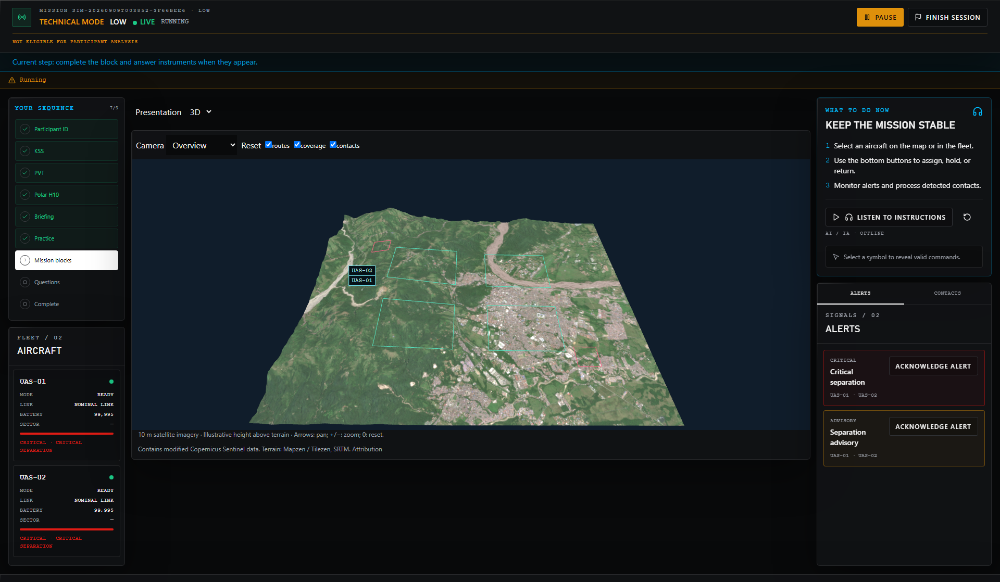

# Three.js presentation verification

This initial Villavicencio report is supplemented by the
[Colombia and traffic verification](colombia-geography-verification.md).

Verified locally on 2026-09-08 (America/Bogota). This report describes software
verification of the implemented presentation condition, not human validation.

## Results

| Check | Result |
| --- | --- |
| Backend runtime, endpoints, recording, replay and debrief | 48 tests passed |
| Focused frontend regression suite | 41 tests passed |
| Additional replay fallback/seek regression | 1 test passed |
| Browser presentation acceptance | 5 tests passed, final run 2.4 minutes |
| Production Next.js build and TypeScript | Passed |
| ESLint | Passed |
| Git whitespace check | Passed |

Backend tests used Python 3.12.13 in the existing MATB environment. The backend
suite reported the existing python_multipart pending-deprecation warning.
Browser acceptance used isolated synthetic test sessions and the repository's
managed backend/frontend runner. The final browser run used the corrected
radiometric package below. The correction does not change engine or replay logic.

The three fleet tests run the reference footprint with 2, 4 and 8 aircraft,
verify rejection before scene readiness, block external HTTPS requests, exercise
overview/follow/drone cameras, pause controls, technical 2D fallback and return,
check geometry counts after remount, and inspect a 390-pixel mobile layout.
The other tests reject a corrupt imagery checksum and complete a short run
through ISA, SAGAT concealment, post-block instruments, sealing and public replay.
Backend tests also cover controller ownership, deduplication, research failure
pause/resume, artifact checksums, state-hash invariance and replay redaction.

## Packaged geography

- Scene: `villavicencio-v1`, centered at 4.15 N, 73.65 W.
- Sentinel-2 product: `S2B_18NXK_20260810_0_L2A`, acquired 2026-08-10.
- Manifest SHA-256: `d0c9b5fd91158456362aa05b77b32c829a10efe442d50ba7765b9a993d6567f3`.
- Imagery: 1600 by 1200 pixels, approximately 10 m; terrain: 161 by 121 samples.
- The provider declares `earthsearch:boa_offset_applied=true`; the packager
  retains that flag and avoids subtracting the radiometric offset twice.
- Source attribution and individual file/source hashes remain in the manifest.

The 0% reported footprint cloud fraction is based on scene-classification
samples at 100 m. It is not a claim that every source pixel is cloud-free.

## Renderer observations

Chromium 151.0.7922.34, viewport 1920 by 1080, DPR 1, ANGLE/Vulkan SwiftShader
software renderer. Values are short functional-run samples, not benchmarks.

| Profile | Aircraft | Draw calls | Triangles | Geometries | Textures | CPU render p95 |
| --- | ---: | ---: | ---: | ---: | ---: | ---: |
| LOW | 2 | 25 | 38,904 | 25 | 2 | 2.9 ms |
| MEDIUM | 4 | 43 | 39,408 | 43 | 2 | 4.2 ms |
| HIGH | 8 | 79 | 40,416 | 79 | 2 | 7.4 ms |

Raw observations: [LOW](assets/suas-threejs/low-renderer-metrics.json),
[MEDIUM](assets/suas-threejs/medium-renderer-metrics.json),
[HIGH](assets/suas-threejs/high-renderer-metrics.json).

CPU render p95 measures JavaScript render submission and label work. It does
not measure GPU completion, browser frame intervals, or physical display latency.
A p95 frame-interval target of 33 ms remains unverified on the research station.
Before participant trials, measure the actual station at the intended resolution
and GPU, including sustained HIGH workload and camera transitions.

## Screenshots

[Overview](assets/suas-threejs/overview.png),
[drone camera](assets/suas-threejs/drone.png),
[mobile](assets/suas-threejs/mobile.png),
[sealed replay](assets/suas-threejs/replay.png).

## Practical limits

The satellite texture is too coarse for person identification or fine visual
inspection. Drone meshes are enlarged schematics. Terrain affects presentation
height only; no collision, occlusion, thermal physics or vertical flight model
was added. Camera poses are sampled at two-second intervals, so replay preserves
recorded observations rather than every displayed frame. Browser timing fields
are presentation observations and do not establish end-to-end physical latency.

Geographic appearance and study performance require separate assessment. No
participant comparison, workload calibration or operational validation was run.

See [implementation and operation](suas-threejs-presentation.md) for setup,
interfaces, scene packaging and attribution.
