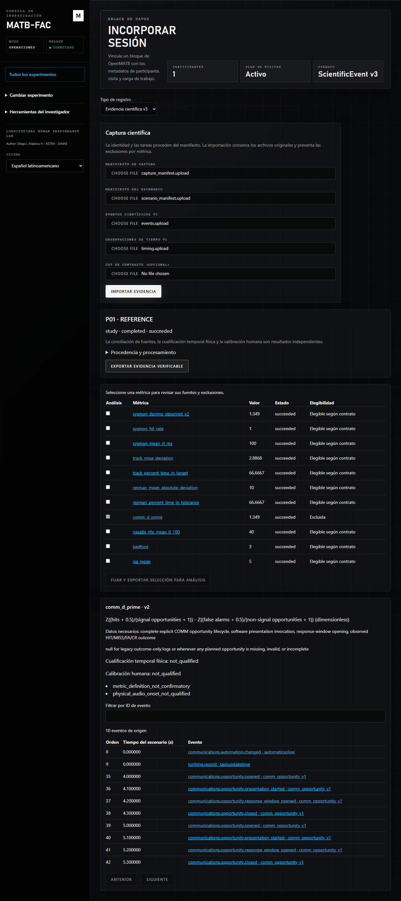

# Classic evidence pipeline: local software verification

Date: 2026-09-09. Baseline: `2fa2533e5662fcd790883e661a57b2136c48bb46`.
The implementation is delivered as dependent runtime, reconciliation and Console
changes. This report describes the integrated local tree. It does not certify a
release, physical timing, human validity or physiological synchronization.

The workstation used Windows, Python 3.12.13 in the existing `matb` environment,
Node 24.18.0, and installed frontend dependencies. This was not a clean-machine
installation. CI is configured for Python 3.12 and Node 22.23.2 on Windows and
Ubuntu; that independent execution remains a release gate.

| Check | Observed result |
| --- | --- |
| Repository contracts/integration/statistics suite, excluding sUAS, Liftoff and documentation directories | 582 passed, 9 skipped; one numerical sampler warning |
| Native OpenMATB suite | 848 passed |
| Backend full component suite | 276 passed, 1 skipped; dependency and statistical warnings |
| Final evidence/lifecycle backend checks after source-text preservation, export-link verification and lock cleanup | 12 passed |
| Frontend Vitest | 147 passed across 44 files |
| ESLint and targeted Python Ruff | Passed |
| Production build, including TypeScript | Passed using isolated `.next/evidence-final` output |
| Final browser acceptance | 1 passed: upload, metric/event/timing inspection, exclusion, export, offline recalculation, reopen |
| Documentation verification | Passed |
| Public-core dry-run before delivery | Completed; existing scientific/privacy/licensing release blockers remained |

The final browser check used the production build and repository-managed
Chromium/backend processes with an isolated database. Its reference capture is
synthetic. It checks that communications remains excluded, that selected task
events expose their software observations, and that an exported ZIP reproduces
metric values, definitions, eligibility and source links without network access.
Backend checks additionally reject altered source links even after ZIP checksums
are recomputed and preserve integers beyond JavaScript's safe range.

Regression testing exposed two test-harness gaps: the component-lifespan tests
needed to mock the new database recovery step, and JSDOM needed a ResizeObserver
shim. A production browser run also exposed an early-interaction hydration race;
the upload format selector is now disabled until its React handler is ready.
The final browser run passed after that correction.

JUnit reports are retained locally under
`webui/frontend/.next/evidence-verification/`; the final browser diagnostics and
synthetic export are under `.next/evidence-acceptance-final/`. Generated caches
and local data are excluded from the implementation commits. The workflow now
retains reports and browser artifacts for 14 days, using separate output folders
so later browser checks do not overwrite earlier evidence.

GitHub Actions previously reported an account billing/spending restriction before
assigning runners. Workflow changes cannot remove that account restriction.
Neither failed pre-run jobs nor local success establishes Windows/Linux CI
success. Do not waive the independent execution gate on the basis of this report.

The original native CSV and runtime JSONL keep their historical interpretation.
Source-reconciled metrics expose software-contract eligibility separately from
physical and human qualification. The added synchronous recorder requires
overhead/timing characterization on the intended laboratory configurations.

The image shows software-generated reference records, not participant results.
