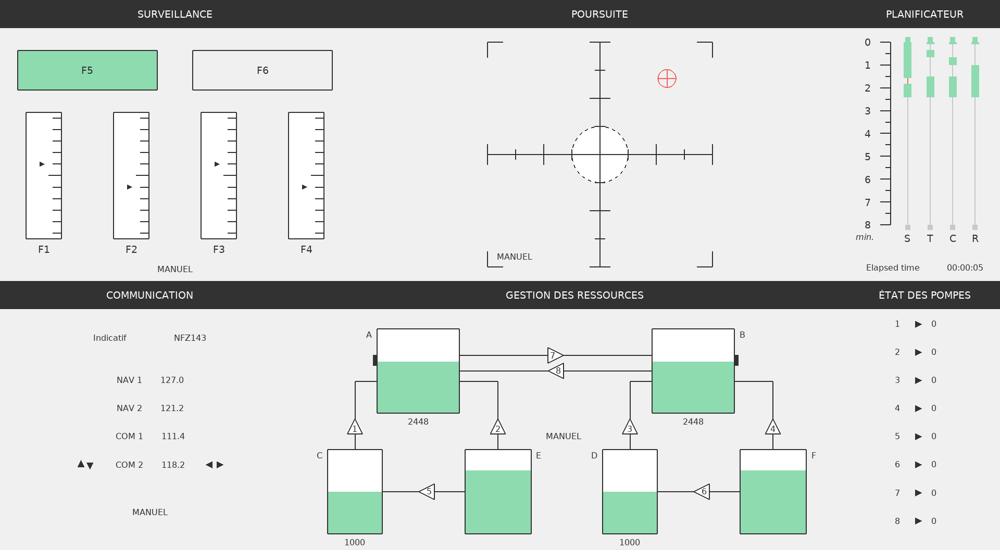

# OpenMATB: versión de código abierto de la batería multitarea MATB

[English version](README.md)

La batería multitarea MATB (*Multi-Attribute Task Battery*) fue presentada en
un memorando técnico de la NASA por Comstock y Arnegard (1992). Reúne tareas
interactivas representativas de determinadas demandas presentes durante el
pilotaje. El participante atiende simultáneamente cuatro tareas:

1. vigilancia de sistemas (SYSMON);
2. seguimiento (TRACK);
3. comunicaciones auditivas (COMM); y
4. gestión de recursos (RESMAN).

La pantalla también incorpora un planificador que muestra la programación de
los eventos de las tareas.



OpenMATB es una reimplementación abierta de MATB que favorece la adaptación de
las tareas, la ampliación del software y la replicabilidad de los experimentos.
Su fundamento se describe en:

Cegarra, J., Valéry, B., Avril, E., Calmettes, C., & Navarro, J. (2020).
OpenMATB: A Multi-Attribute Task Battery promoting task customization, software
extensibility and experiment replicability. *Behavior Research Methods*, 52,
1980–1990. https://doi.org/10.3758/s13428-020-01364-w

OpenMATB es una herramienta de investigación. No es un sistema certificado de
entrenamiento de vuelo, una estación ATS ni una reproducción operacional de una
cabina.

Contacto: <a href="mailto:julien.cegarra@univ-jfc.fr">julien.cegarra AT univ-jfc.fr</a>;
<a href="mailto:benoit.valery@univ-jfc.fr">benoit.valery AT univ-jfc.fr</a>

## Requisitos

La versión actual requiere Python 3.9 o posterior y las bibliotecas indicadas
en `requirements.txt`, entre ellas:

- [pyglet](https://github.com/pyglet/pyglet);
- [pyparallel](https://github.com/pyserial/pyparallel);
- [rstr](https://github.com/leapfrogonline/rstr); y
- [pylsl](https://github.com/chkothe/pylsl).

El programa es compatible con Windows, macOS y Linux. Para la tarea TRACK se
recomienda un joystick.

## Instalación multiplataforma

Instale Python 3.9 o posterior, clone el repositorio y, desde la carpeta
`openmatb`, instale las dependencias:

```bash
python -m pip install -r requirements.txt
```

En Windows puede ser necesario sustituir `python` por `py`. Inicie la aplicación
desde la carpeta `openmatb`:

```bash
python main.py
```

Para abrir el generador gráfico de escenarios:

```bash
python scenario_generator_ui.py
```

### Entorno virtual

Para aislar las dependencias puede crear un entorno virtual `.venv`:

```bash
python -m venv .venv
```

Actívelo con `source .venv/bin/activate` en Linux/macOS o con
`.venv\Scripts\activate.bat` en Windows; después instale `requirements.txt`.

## Idioma español

La configuración distribuida usa español colombiano:

```ini
[Openmatb]
language=es_CO
```

También están disponibles `en_EN` y `fr_FR`. El locale `es_CO` incluye la
interfaz principal, el generador de escenarios, mensajes de validación,
instrucciones, cuestionarios y dos voces sintéticas para COMM.

Las letras de los distintivos de llamada se reproducen mediante el alfabeto de
deletreo radiotelefónico OACI. Las cifras se expresan en español y el separador
de frecuencia se pronuncia «decimal». Consulte
[Terminología aeronáutica](locales/es_CO/TERMINOLOGIA.md).

## Uso básico

`main.py` lee `config.ini`, donde se configuran el idioma, la pantalla, el modo
de pantalla completa y el escenario. `scenario_path` puede señalar un archivo
dentro de `includes/scenarios`; si queda vacío, la aplicación muestra un
selector.

Un escenario es un archivo de texto que indica el instante y el comando que
debe ejecutar cada complemento. Los alias y comandos son identificadores de la
aplicación y no se traducen:

```text
0:00:00;sysmon;start
0:00:00;track;start
0:00:00;scheduling;start
0:00:00;resman;start
0:00:00;communications;start
0:02:30;sysmon;stop
0:02:30;track;stop
0:02:30;communications;stop
0:02:30;resman;stop
0:02:30;scheduling;stop
```

Mediante estos archivos se pueden iniciar o detener tareas, modificar
parámetros y programar eventos. El generador gráfico permite crear bloques de
dificultad, insertar instrucciones o cuestionarios y guardar configuraciones.

Al finalizar, OpenMATB guarda en `sessions` un registro CSV de eventos,
entradas, estados y métricas de rendimiento. Los nombres de campos del registro
se conservan estables para no romper análisis existentes.

## Tareas y terminología

- **SYSMON — Vigilancia de sistemas:** supervisión de luces e indicadores y
  respuesta ante condiciones anormales.
- **TRACK — Seguimiento:** control de una retícula para mantenerla dentro de la
  zona objetivo.
- **COMM — Comunicaciones:** identificación del distintivo de llamada y
  sintonización de la radio indicada.
- **RESMAN — Gestión de recursos:** control de bombas para mantener los niveles
  objetivo de los depósitos.
- **Programación:** visualización temporal de la activación de las tareas y de
  su estado de automatización.

Las abreviaturas SYSMON, TRACK, COMM, RESMAN, NAV y COM se conservan porque son
identificadores de tarea o de equipo dentro de MATB.

## Cuestionarios

La distribución incluye versiones españolas de NASA-TLX y ejemplos de escalas
genéricas. La presencia de una traducción no implica por sí sola que exista una
validación psicométrica para toda población o contexto. El protocolo del estudio
debe documentar la versión aplicada y su fundamento.

## Audio COMM

Las voces se seleccionan mediante los parámetros internos:

```text
communications;voiceidiom;spanish
communications;voicegender;female
```

Los valores válidos de `voiceidiom` son `spanish`, `english` y `french`; los de
`voicegender` son `female` y `male`. Estos valores no se traducen porque forman
parte del formato del escenario.

Las voces españolas distribuidas son generadas por inteligencia artificial con
la API de voz de OpenAI y se reproducen desde archivos WAV locales: OpenMATB no
necesita una credencial ni conexión de red durante una sesión. `female` y `male`
son selectores históricos de compatibilidad y no clasificaciones de género de
las voces de OpenAI. El manifiesto auditable y el procedimiento de regeneración
se documentan en [includes/sounds/spanish](includes/sounds/spanish/README.md).

La referencia a OACI describe el alfabeto radiotelefónico y la lectura de cifras
de frecuencia. El mensaje completo sigue siendo una instrucción experimental de
MATB y no se presenta como fraseología ATS operacional ni certificada.

## Desarrollo y pruebas

Instale las dependencias de desarrollo y ejecute:

```bash
python -m pip install -r requirements-dev.txt
pytest -q
ruff check .
python locales/build_catalog.py --locale es_CO --check
```

Para actualizar la plantilla y compilar el catálogo binario:

```bash
python locales/build_catalog.py --locale es_CO --check --write-template --compile
```

## Tutoriales y licencia

La documentación adicional está disponible en la
[wiki de OpenMATB](https://github.com/juliencegarra/OpenMATB/wiki). Consulte
[LICENSE](LICENSE) para las condiciones de distribución del software.
